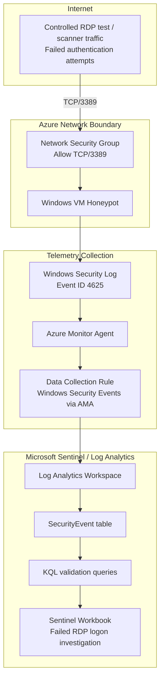

# Azure Sentinel Honeypot — RDP 4625 Failed Logon Detection V1

## Purpose

This project builds a small Azure cloud security lab that intentionally exposes a Windows VM on TCP/3389 for a controlled, timeboxed RDP honeypot test. The lab collects Windows failed logon events, sends them into Microsoft Sentinel through Azure Monitor Agent, validates Event ID `4625`, and visualizes failed RDP authentication activity in a Sentinel workbook.

This is a learning lab, not a production deployment. The VM was intentionally internet-facing for evidence collection and was stopped, deallocated, and deleted after validation.

## What this project demonstrates

- Microsoft Sentinel onboarding for Windows Security Events using Azure Monitor Agent.
- Failed RDP logon analysis using Windows Security Event ID `4625`.
- KQL querying against the `SecurityEvent` table.
- Sentinel workbook creation for failed-logon investigation.
- Azure networking fundamentals: VNet, subnet, NSG, and controlled inbound exposure.
- Cloud security guardrails: scoped exposure, cost control, timeboxing, evidence capture, and cleanup.
- Documentation discipline for cloud security labs.

## Architecture



## Lab Execution Status

The Sentinel RDP honeypot lab was successfully deployed, validated, safely stopped, and cleaned up after evidence capture.

Current status:

| Component                | Status                                                                                                      |
| ------------------------ | ----------------------------------------------------------------------------------------------------------- |
| Resource group           | Deleted after evidence capture                                                                              |
| VM                       | Stopped/deallocated before cleanup                                                                          |
| Network exposure         | TCP/3389 was intentionally exposed for a controlled, timeboxed honeypot test                                |
| Azure Monitor Agent      | Installed successfully on the Windows VM                                                                    |
| Data Collection Rule     | Configured for Windows Security Events via AMA                                                              |
| Microsoft Sentinel       | Enabled on the Log Analytics workspace                                                                      |
| SecurityEvent ingestion  | Confirmed                                                                                                   |
| Event ID 4625 validation | Confirmed failed logon events captured                                                                      |
| Sentinel workbook        | Created and saved                                                                                           |
| Cost guardrails          | Configured: resource-group budget, Log Analytics daily cap, VM auto-shutdown, and VM deallocation confirmed |
| Cleanup                  | Completed: lab resource group deleted after evidence capture                                                |

The VM `vm-honeypot-rdp-v1` was stopped and deallocated after successful validation of the telemetry pipeline. This confirmed that the lab was not left running unnecessarily after the required evidence was collected.

Validated telemetry path:

```text
Failed RDP authentication attempt
→ Windows Security Event Log
→ Azure Monitor Agent
→ Data Collection Rule
→ Log Analytics Workspace
→ Microsoft Sentinel
→ SecurityEvent table
→ Sentinel workbook
```

Key validation evidence captured:

- Resource-group-scoped budget guardrail
- Log Analytics daily cap
- Microsoft Sentinel enabled on the Log Analytics workspace
- VNet, subnet, and NSG configuration
- Inbound NSG rule allowing TCP/3389 for the controlled honeypot test
- Azure Monitor Agent installed on the VM
- Windows Security Events via AMA data collection rule
- `SecurityEvent` table receiving logs
- Event ID `4625` failed logon events visible in Sentinel
- Sentinel workbook created for failed RDP logon investigation
- VM stopped/deallocated after evidence capture
- Lab resource group deleted during cleanup

Sensitive values such as public IP addresses, source IP addresses, subscription IDs, usernames, and account names were redacted from public-facing evidence.

Cleanup was completed after evidence capture. The lab resource group `rg-sentinel-honeypot-v1` was deleted, removing the VM, public IP, NIC, OS disk, VNet, NSG, DCR, Log Analytics workspace, Sentinel configuration, workbook, and supporting resources created for this lab.

## Key design decisions

This V1 intentionally avoids the older tutorial pattern of:

- Allowing unrestricted inbound Any/Any traffic.
- Turning off Windows Defender Firewall.
- Writing custom free-form logs.
- Using third-party GeoIP API keys.
- Manually training custom field extraction in Log Analytics.

Instead, this version uses:

- NSG inbound exposure limited to TCP/3389 for the honeypot test.
- Windows Defender Firewall left enabled.
- Windows Security Events via AMA.
- Minimal Windows Security Event collection where possible.
- Native `SecurityEvent` telemetry.
- KQL-based validation of Event ID `4625`.
- Sentinel workbook visualization for failed RDP logon analysis.
- Budget alerts, Log Analytics daily cap, VM auto-shutdown, manual VM deallocation, and mandatory resource group cleanup.

## Guardrails

| Area             | Control                                                                                                |
| ---------------- | ------------------------------------------------------------------------------------------------------ |
| Network exposure | TCP/3389 only                                                                                          |
| Host firewall    | Windows Defender Firewall left enabled                                                                 |
| Isolation        | Dedicated resource group, VNet, subnet, and no peering                                                 |
| Cost             | Resource-group budget, Log Analytics daily cap, VM auto-shutdown, and short run window                 |
| Runtime          | Timeboxed execution window                                                                             |
| Cleanup          | VM stopped/deallocated after validation; resource group deleted after evidence capture                 |
| Secrets          | No API keys, credentials, subscription IDs, public IPs, source IPs, or usernames committed to the repo |
| Evidence         | Screenshots sanitized before publication                                                               |

## Build phases

1. Create Azure resource group.
2. Apply project tags.
3. Create Log Analytics workspace.
4. Configure Log Analytics daily cap.
5. Enable Microsoft Sentinel.
6. Create cost budget guardrail.
7. Create VNet, subnet, and NSG.
8. Configure inbound NSG rule for TCP/3389.
9. Create Windows VM.
10. Enable VM auto-shutdown.
11. Configure Windows Security Events via AMA.
12. Validate Azure Monitor Agent installation.
13. Generate a controlled failed RDP logon.
14. Validate Event ID `4625` in the `SecurityEvent` table.
15. Create Sentinel workbook for failed RDP logon investigation.
16. Capture sanitized evidence.
17. Stop/deallocate the VM.
18. Delete the resource group.
19. Capture cleanup evidence.

## KQL queries

KQL files are stored in `/kql`:

| File                                 | Purpose                                                |
| ------------------------------------ | ------------------------------------------------------ |
| `00_schema_discovery.kql`            | Inspect available columns in the `SecurityEvent` table |
| `01_validate_4625_pipeline.kql`      | Validate failed logon ingestion                        |
| `02_failed_rdp_logons_over_time.kql` | Summarize failed RDP logons over time                  |
| `03_top_usernames.kql`               | Identify attempted account names                       |
| `04_top_source_ips.kql`              | Identify top failed-logon source IPs                   |
| `05_sanitized_4625_validation.kql`   | Produce public-safe Event ID 4625 evidence             |

### Validate SecurityEvent ingestion

```kql
SecurityEvent
| where TimeGenerated > ago(2h)
| summarize count() by EventID
| order by count_ desc
```

### Validate Event ID 4625

```kql
SecurityEvent
| where TimeGenerated > ago(2h)
| where EventID == 4625
| project TimeGenerated, EventID, Computer, AccountType, LogonType, Activity
| order by TimeGenerated desc
```

### Failed RDP logons over time

```kql
SecurityEvent
| where TimeGenerated > ago(24h)
| where EventID == 4625
| summarize FailedLogons=count() by bin(TimeGenerated, 15m)
| order by TimeGenerated asc
```

### Failed logon event details

```kql
SecurityEvent
| where TimeGenerated > ago(24h)
| where EventID == 4625
| project TimeGenerated, Computer, Account, AccountType, LogonType, IpAddress, Activity
| order by TimeGenerated desc
```

> Do not publish raw output from detailed queries unless usernames, public IPs, and source IPs are redacted.

## Evidence checklist

Screenshots should be saved under `/evidence/sanitized-screenshots`:

| Evidence file                            | Purpose                                                  |
| ---------------------------------------- | -------------------------------------------------------- |
| `01-resource-group-inventory.png`        | Shows the lab resources before cleanup                   |
| `02-cost-budget-guardrail.png`           | Shows the resource-group budget guardrail                |
| `03-log-analytics-daily-cap.png`         | Shows the Log Analytics daily cap set to `0.25 GB/day`   |
| `04-sentinel-enabled.png`                | Shows Microsoft Sentinel enabled for the workspace       |
| `05-vnet-subnet-nsg.png`                 | Shows VNet/subnet configuration                          |
| `06-rdp-nsg-rule.png`                    | Shows the intentional TCP/3389 inbound NSG rule          |
| `07-ama-extension-installed.png`         | Shows Azure Monitor Agent installed on the VM            |
| `08-dcr-windows-security-events-ama.png` | Shows Windows Security Events via AMA and the DCR        |
| `09-securityevent-ingestion.png`         | Shows `SecurityEvent` logs flowing                       |
| `10-eventid-4625-validation.png`         | Shows sanitized Event ID `4625` validation               |
| `11-sentinel-workbook-failed-logons.png` | Shows the Sentinel workbook visualization                |
| `12-vm-stopped-deallocated.png`          | Shows the VM stopped/deallocated after evidence capture  |
| `13-cleanup-complete.png`                | Shows cleanup verification after resource group deletion |

## Repository structure

```text
sentinel-honeypot-rdp-v1/
├── docs/
│   ├── adr/
│   ├── architecture.md
│   ├── cleanup.md
│   ├── cost-guardrails.md
│   ├── runbook.md
│   └── threat-model.md
├── evidence/
│   ├── README.md
│   ├── redactions/
│   └── sanitized-screenshots/
├── kql/
│   ├── 00_schema_discovery.kql
│   ├── 01_validate_4625_pipeline.kql
│   ├── 02_failed_rdp_logons_over_time.kql
│   ├── 03_top_usernames.kql
│   ├── 04_top_source_ips.kql
│   └── 05_sanitized_4625_validation.kql
├── scripts/
├── README.md
└── SECURITY.md
```

## Cleanup summary

The lab was deleted after validation by removing the resource group:

```text
rg-sentinel-honeypot-v1
```

Deleting the resource group removed the lab-created:

- Windows VM
- Public IP
- Network interface
- OS disk
- Virtual network
- Subnet
- Network security group
- Data collection rule
- Log Analytics workspace
- Microsoft Sentinel configuration
- Sentinel workbook
- Supporting lab-scoped resources

## Lessons learned

- Platform guardrails should be created before workload exposure.
- Public RDP is dangerous in production but useful in a controlled honeypot lab when timeboxed and monitored.
- Subnet-level NSG design provides a clean network boundary for this V1 lab.
- AMA and DCR provide a modern telemetry path into Sentinel.
- The `SecurityEvent` table is sufficient for validating Windows failed logon telemetry.
- Event ID `4625` validates failed authentication activity.
- Budgets and daily caps are alerting and containment guardrails, not substitutes for cleanup.
- VM deallocation and resource group deletion are the strongest cost-control actions after evidence capture.
- Sanitized evidence is critical before publishing cloud-security lab artifacts.

## Roadmap

- V1: Failed RDP logon detection and Sentinel workbook validation.
- V2: Add a scheduled analytics rule for RDP brute-force detection.
- V3: Add an incident response mini-runbook.
- V4: Add Logic Apps automation/playbook for notification and tagging.
- V5: Add KQL geolocation enrichment and workbook map visualization.
- V6: Expand into multi-cloud telemetry and SOC workflow integration.

## References

- Collect Windows events from VMs with Azure Monitor Agent: https://learn.microsoft.com/en-us/azure/azure-monitor/vm/data-collection-windows-events
- Windows security event sets for Microsoft Sentinel: https://learn.microsoft.com/en-us/azure/sentinel/windows-security-event-id-reference
- Azure Monitor Logs cost guidance: https://learn.microsoft.com/en-us/azure/azure-monitor/logs/cost-logs
- Microsoft Sentinel documentation: https://learn.microsoft.com/en-us/azure/sentinel/
