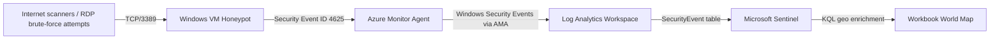

# Azure Sentinel Honeypot — RDP 4625 World Map V1

## Purpose

This project builds a small Azure cloud security lab that exposes a Windows VM on TCP/3389 to collect real-world RDP failed logon attempts, send Windows Security Events into Microsoft Sentinel, and visualize source IP geolocation on a workbook map.

This is a learning lab, not a production deployment. The VM is intentionally internet-facing and must be timeboxed, monitored, and deleted after evidence capture.

## What this project demonstrates

- Microsoft Sentinel onboarding for Windows Security Events using Azure Monitor Agent.
- Failed RDP logon analysis using Windows Security Event ID 4625.
- KQL querying against the `SecurityEvent` table.
- Geo-enrichment with `geo_info_from_ip_address()`.
- Workbook visualization for attack source mapping.
- Cloud security guardrails: scoped exposure, cost control, cleanup, and evidence capture.

## Architecture



## Key design decisions

This V1 intentionally avoids the older tutorial pattern of:

- Allowing inbound Any/Any traffic.
- Turning off Windows Defender Firewall.
- Writing custom free-form logs.
- Using a third-party GeoIP API key.
- Manually training field extraction in Log Analytics.

Instead, this version uses:

- NSG inbound: TCP/3389 only.
- Windows Defender Firewall left ON.
- Sentinel Windows Security Events via AMA connector.
- Minimal Windows Security Event collection set where possible.
- KQL-based geolocation using `geo_info_from_ip_address()`.
- Budget alerts, timeboxing, and mandatory resource group cleanup.

## Guardrails

| Area | Control |
|---|---|
| Network exposure | TCP/3389 only |
| Host firewall | Keep Windows Defender Firewall ON |
| Isolation | Dedicated resource group, VNet, subnet, and no peering |
| Cost | Budget alerts, short run window, minimal event collection |
| Runtime | 1–4 hour timebox |
| Cleanup | Delete the resource group after evidence capture |
| Secrets | No API keys or credentials committed to repo |

## Build phases

1. Create Azure resource group.
2. Create Log Analytics workspace.
3. Enable Microsoft Sentinel.
4. Create VNet, subnet, NSG, and Windows VM.
5. Allow inbound TCP/3389 only.
6. Enable VM auto-shutdown.
7. Configure budget alerts.
8. Enable Windows Security Events via AMA connector.
9. Generate a failed RDP test login.
10. Validate Event ID 4625 in `SecurityEvent`.
11. Build Sentinel workbook map.
12. Capture evidence.
13. Delete the resource group.

## KQL queries

KQL files are stored in `/kql`:

| File | Purpose |
|---|---|
| `00_schema_discovery.kql` | Inspect available columns |
| `01_validate_4625_pipeline.kql` | Validate failed logon ingestion |
| `02_failed_rdp_world_map.kql` | Build workbook map dataset |
| `03_top_usernames.kql` | Identify attempted usernames |
| `04_top_source_ips.kql` | Identify top source IPs |

## Evidence checklist

Screenshots should be saved under `/evidence/screenshots`:

- NSG inbound rule showing TCP/3389 only.
- Sentinel connector configuration.
- `SecurityEvent` query showing Event ID 4625.
- Workbook map.
- Budget alerts.
- Resource group deletion confirmation.

## Repository structure

```text
sentinel-honeypot-rdp-v1/
├── docs/
│   ├── adr/
│   ├── architecture.md
│   ├── cleanup.md
│   ├── cost-guardrails.md
│   ├── runbook.md
│   └── threat-model.md
├── evidence/
│   ├── README.md
│   ├── redactions/
│   └── screenshots/
├── kql/
├── scripts/
├── README.md
└── SECURITY.md
```

## Roadmap

- V1: Sentinel workbook map from failed RDP logons.
- V2: Add scheduled analytics rule for brute-force detection.
- V3: Add incident response mini-runbook.
- V4: Add automation/playbook for notification and tagging.
- V5: Expand into multi-cloud telemetry and SOC workflow integration.

## References

- Collect Windows events from VMs with Azure Monitor Agent: https://learn.microsoft.com/en-us/azure/azure-monitor/vm/data-collection-windows-events
- Windows security event sets for Microsoft Sentinel: https://learn.microsoft.com/en-us/azure/sentinel/windows-security-event-id-reference
- KQL geo enrichment: https://learn.microsoft.com/en-us/kusto/query/geo-info-from-ip-address-function
- Azure Monitor Logs cost guidance: https://learn.microsoft.com/en-us/azure/azure-monitor/logs/cost-logs
