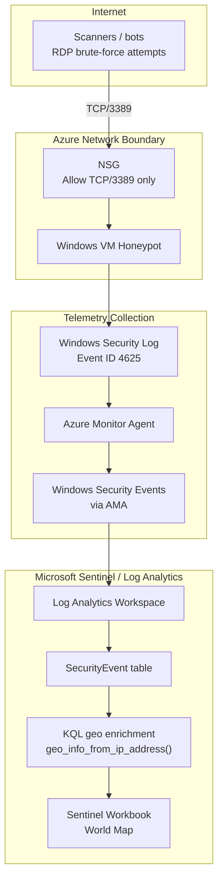

# Architecture

## Overview

This project uses a deliberately internet-facing Windows VM to generate failed RDP logon telemetry, then sends Windows Security Events into Microsoft Sentinel for analysis and visualization.

The V1 architecture prioritizes a realistic Sentinel workflow while avoiding unsafe legacy tutorial patterns such as Any/Any inbound rules, disabled host firewalls, third-party GeoIP API keys, and manual custom field extraction.

## Architecture Diagram

## Boundary Explanation

### 1. Internet Boundary

This boundary represents external scanners, bots, and opportunistic brute-force sources on the public internet.

The lab intentionally exposes TCP/3389 so the VM can receive failed RDP logon attempts. The objective is to generate real-world Event ID 4625 telemetry for Sentinel analysis.

### 2. Azure Network Boundary

This boundary contains the Azure network controls and the honeypot VM.

The Network Security Group allows inbound TCP/3389 only. The lab intentionally avoids Any/Any inbound rules and keeps Windows Defender Firewall enabled to preserve a minimum defensible security posture.

### 3. Telemetry Collection Boundary

This boundary represents the path from local Windows event generation to Azure Monitor collection.

Failed RDP attempts create Windows Security Event ID 4625 on the VM. Azure Monitor Agent collects the relevant Windows Security Events through the Sentinel Windows Security Events via AMA connector.

### 4. Microsoft Sentinel / Log Analytics Boundary

This boundary represents SIEM storage, query, enrichment, and visualization.

Collected events land in the Log Analytics workspace, where Sentinel queries the `SecurityEvent` table. KQL enriches source IPs with `geo_info_from_ip_address()`, and the workbook visualizes failed RDP attempts on a world map.

## Security Design Notes

- TCP/3389 is exposed only for lab telemetry generation.
- Any/Any inbound exposure is intentionally avoided.
- Windows Defender Firewall remains enabled.
- The VM is isolated in a dedicated resource group and network.
- The run is timeboxed and must end with resource group deletion.
- Geo-enrichment is performed in KQL, not through a third-party API key.

## Evidence Mapping

| Architecture Component | Evidence Screenshot |
|---|---|
| NSG allowing TCP/3389 only | `evidence/screenshots/01_nsg_3389_only.png` |
| Windows Security Events via AMA connector | `evidence/screenshots/02_connector_windows_events_via_ama.png` |
| Event ID 4625 in `SecurityEvent` | `evidence/screenshots/03_securityevent_4625_query.png` |
| Sentinel workbook map | `evidence/screenshots/04_workbook_map.png` |
| Cost guardrails | `evidence/screenshots/05_budget_alerts.png` |
| Resource group deletion | `evidence/screenshots/06_resource_group_deleted.png` |
